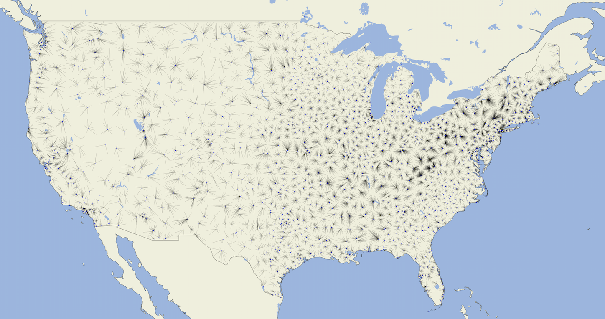

.. spelling::

    metadata

Basic Usage
===========

This document describes how to get started with eeweather.

Matching to weather stations
----------------------------

EEweather is designed to support the process of finding sources of data that
correspond to particular sites. As there are many approaches to this process
of matching, the EEweather package is designed to be flexible and to
accommodate many different approaches.

EEweather provides sensible default mappings from geographical markers to
weather stations so that it can be used out of the box.

EEweather uses lat/long coordinates as targets for weather matching.
This method is described below.

Latitude/Longitude Coordinates
//////////////////////////////

The recommended way to find the weather station(s) that correspond to a
particular site is to use the lat-long coordinates of that site.

Example usage::

    >>> import eeweather
    >>> result = eeweather.match_lat_long(35, -95)
    >>> result
    ISDStationMapping('722178')

This ``ISDStationMapping`` object captures some information about the mapping::

    >>> result.distance_meters
    34672.136079403026
    >>> result.warnings
    []

That particular result has no associated warnings, but other mappings may have
associated warnings, such as the mapping from this point which is in the middle
of the Gulf of Mexico, 700km away from the nearest weather station and outside
of the climate zone boundary::

    >>> result = eeweather.match_lat_long(20, -95)
    >>> result.distance_meters
    700435
    >>> result.warnings
    ['Distance from target to weather station is greater than 50km.', 'Mapped weather station is not in the same climate zone as the provided lat/long point.']

ZIP Code Tabulation Areas (ZCTAs)
/////////////////////////////////

ZIP codes are often abused as rough geographic markers. They are not
particularly well set up be used as the basis of a GIS system - some ZIP codes
correspond to single buildings or post-offices, some cover thousands of square
miles of land. The US Census Bureau transforms census blocks into what they
call ZIP Code Tabulation Areas, and use these instead. There are roughly 10k
ZIP codes that are not used as ZCTAs, and ZCTAs do not correspond directly to
ZIP codes, but for matching to weather stations, which are much sparser than
ZIP codes, this rough mapping is usually sufficient. Often tens or hundreds of
ZCTAs will be matched to the same weather station. We provide a function
:any:`eeweather.zcta_to_lat_long` which allows for a ZCTA to be converted into
a latitude and longitude (the centroid of the ZCTA) which can be used to match
to a weather station using the latitude/longitude method mentioned above.

.. note:: The default mapping concentrates on weather stations in US states
   (including AK, HI) and territories, including PR, GU, VI etc).

Example usage::

    >>> lat, long = eeweather.zcta_to_lat_long('91104')
    >>> lat, long
    (34.1678418058534, -118.123485581459)

Obtaining temperature data
--------------------------

These matching results carry a reference to a weather station object. The
weather station object has some associated metadata and - most importantly -
has methods for obtaining weather data.

Let's look at the following mapping result object::

    >>> result = eeweather.match_lat_long(35, -95)
    >>> station = result.isd_station
    >>> station
    ISDStation('722178')

This ``ISDStation`` object carries information about that station and methods
for fetching corresponding weather data.

The ``.json()`` method gives a quick summary of associated metadata in a
format that can easily be serialized::

    >>> import json
    >>> print(json.dumps(station.json(), indent=2)
    {
      "elevation": 137.5,
      "latitude": 35.021,
      "longitude": -94.621,
      "icao_code": "KRKR",
      "name": "ROBERT S KERR AIRPORT",
      "quality": "high",
      "wban_ids": [
        "53953",
        "99999"
      ],
      "recent_wban_id": "53953",
      "climate_zones": {
        "iecc_climate_zone": "3",
        "iecc_moisture_regime": "A",
        "ba_climate_zone": "Mixed-Humid",
        "ca_climate_zone": null
      }
    }

Most of these are also stored as attributes on the object::

    >>> station.usaf_id
    '722178'
    >>> station.latitude, station.longitude
    (35.021, -94.621)
    >>> station.coords
    (35.021, -94.621)
    >>> station.name
    'ROBERT S KERR AIRPORT'
    >>> station.iecc_climate_zone
    '3'
    >>> station.iecc_moisture_regime
    'A'

In addition to these simple attributes there are a host of methods that can be used to fetch temperature data. The simplest are these, which return `pandas.Series` objects. The start and end date timezones must be explicilty set to UTC.

Note that this temperature data is given in degrees *Celsius*, not Fahrenheit. (:math:`T_F = T_C \cdot 1.8 + 32`), and that the ``pd.Timestamp`` index is given in UTC.

ISD temperature data as an hourly time series::

    >>> import datetime
    >>> import pytz
    >>> start_date = datetime.datetime(2016, 6, 1, tzinfo=pytz.UTC)
    >>> end_date = datetime.datetime(2017, 9, 15, tzinfo=pytz.UTC)
    >>> tempC = station.load_isd_hourly_temp_data(start_date, end_date)
    >>> tempC.head()
    2016-06-01 00:00:00+00:00    21.3692
    2016-06-01 01:00:00+00:00    20.6325
    2016-06-01 02:00:00+00:00    19.4858
    2016-06-01 03:00:00+00:00    19.0883
    2016-06-01 04:00:00+00:00    18.8858
    Freq: H, dtype: float64
    >>> tempF = tempC * 1.8 + 32
    >>> tempF.head()
    2016-06-01 00:00:00+00:00    70.46456
    2016-06-01 01:00:00+00:00    69.13850
    2016-06-01 02:00:00+00:00    67.07444
    2016-06-01 03:00:00+00:00    66.35894
    2016-06-01 04:00:00+00:00    65.99444

ISD temperature data as a daily time series::

    >>> tempC = station.load_isd_daily_temp_data(start_date, end_date)
    >>> tempC.head()
    2016-06-01 00:00:00+00:00    21.329063
    2016-06-02 00:00:00+00:00    21.674583
    2016-06-03 00:00:00+00:00    22.434306
    2016-06-04 00:00:00+00:00    22.842674
    2016-06-05 00:00:00+00:00    21.850521
    Freq: D, dtype: float64
    >>> tempF = tempC * 1.8 + 32
    >>> tempF.head()
    2016-06-01 00:00:00+00:00    70.392313
    2016-06-02 00:00:00+00:00    71.014250
    2016-06-03 00:00:00+00:00    72.381750
    2016-06-04 00:00:00+00:00    73.116813
    2016-06-05 00:00:00+00:00    71.330937
    Freq: D, dtype: float64

GSOD temperature data as a daily time series::

    >>> tempC = station.load_gsod_daily_temp_data(start_date, end_date)
    >>> tempC.head()
    2016-06-01 00:00:00+00:00    21.111111
    2016-06-02 00:00:00+00:00    21.833333
    2016-06-03 00:00:00+00:00    22.277778
    2016-06-04 00:00:00+00:00    22.777778
    2016-06-05 00:00:00+00:00    21.833333
    Freq: D, dtype: float64
    >>> tempF = temps * 1.8 + 32
    >>> tempF.head()
    2016-06-01 00:00:00+00:00    70.0
    2016-06-02 00:00:00+00:00    71.3
    2016-06-03 00:00:00+00:00    72.1
    2016-06-04 00:00:00+00:00    73.0
    2016-06-05 00:00:00+00:00    71.3
    Freq: D, dtype: float64

This station does not contain TMY3 data. To require that TMY3 data is available at the matched weather station, replace the default mapping which ones that only maps to stations containing TMY3 data:: 

    >>> from eeweather.mappings import oee_lat_long_tmy3
    >>> result = eeweather.match_lat_long(35, -95, mapping=oee_lat_long_tmy3)
    >>> station = result.isd_station
    ISDStation('785430')

TMY3 temperature data as an hourly time series::

    >>> tempC = station.load_tmy3_hourly_temp_data(start_date, end_date)
    >>> tempC.head()

    2016-06-01 00:00:00+00:00    26.7
    2016-06-01 01:00:00+00:00    26.3
    2016-06-01 02:00:00+00:00    26.0
    2016-06-01 03:00:00+00:00    25.6
    2016-06-01 04:00:00+00:00    25.3
    Freq: D, dtype: float64
    >>> tempF = temps * 1.8 + 32
    >>> tempF.head()
    2016-06-01 00:00:00+00:00    80.06
    2016-06-01 01:00:00+00:00    79.34
    2016-06-01 02:00:00+00:00    78.80
    2016-06-01 03:00:00+00:00    78.08
    2016-06-01 04:00:00+00:00    77.54
    Freq: D, dtype: float64

A similar mapping can be done for CZ2010 stations, which are specific to California:: 

    >>> from eeweather.mappings import oee_lat_long_cz2010
    >>> result = eeweather.match_lat_long(35, -95, mapping=oee_lat_long_cz2010)
    >>> station = result.isd_station
    ISDStation('723805')

CZ2010 temperature data as an hourly time series::

    >>> tempC = station.load_cz2010_hourly_temp_data(start_date, end_date)
    >>> tempC.head()
    2016-06-01 00:00:00+00:00    26.7
    2016-06-01 01:00:00+00:00    26.3
    2016-06-01 02:00:00+00:00    26.0
    2016-06-01 03:00:00+00:00    25.6
    2016-06-01 04:00:00+00:00    25.3
    Freq: D, dtype: float64
    >>> tempF = temps * 1.8 + 32
    >>> tempF.head()
    2016-06-01 00:00:00+00:00    80.06
    2016-06-01 01:00:00+00:00    79.34
    2016-06-01 02:00:00+00:00    78.80
    2016-06-01 03:00:00+00:00    78.08
    2016-06-01 04:00:00+00:00    77.54
    Freq: H, dtype: float64
